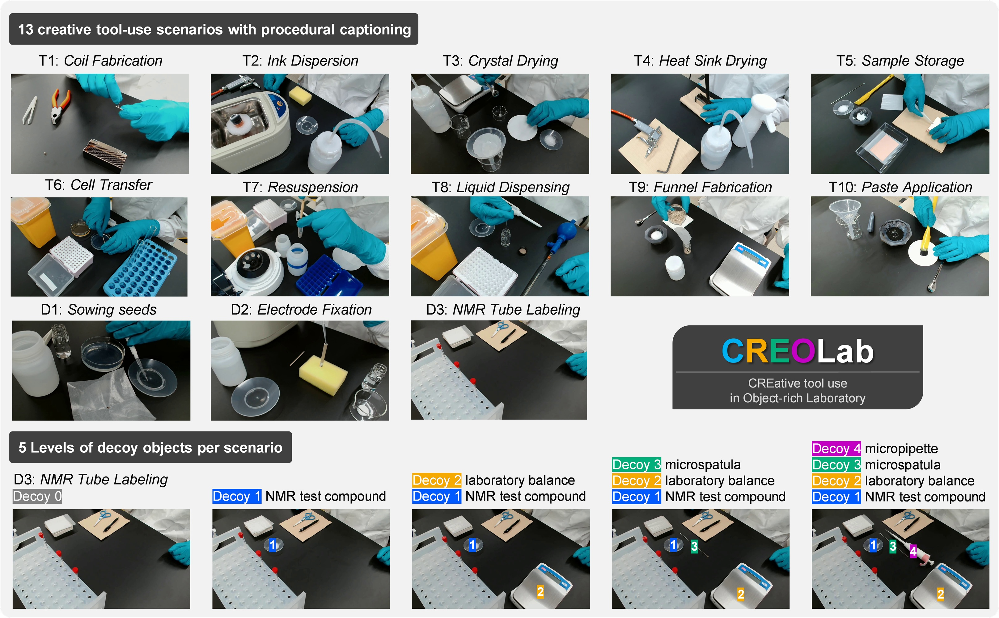

# CREOLab

**CRE**ative tool use in **O**bject-rich **Lab**oratory




**License**: The dataset and code are provided under the same license for non-commercial research use only. See [LICENSE.md](LICENSE.md) for details.

## Dataset

This repository provides a dataset of experimental procedure videos with ground truth annotations, designed for research on automatic procedure generation from laboratory videos.

**Video dataset and ground truth procedures are available via DOI:**

`https://doi.org/[TO_BE_ANNOUNCED]`

### Dataset Contents

The dataset includes:
- **65 experimental procedure videos** (13 scenarios × 5 decoy variations each)
  - Scenarios 01-10: test split (referred to as T1-T10 in the paper)
  - Scenarios 11-13: dev split (referred to as D1-D3 in the paper)
- **Caption files** (one per video) containing:
  - Ground truth procedural annotations with step-by-step instructions
  - Objects’ coordinates and labels
- **Dataset splits** for reproducible evaluation

### Example of Procedural Captioning

```
1. Write a number on the weighing paper using a ballpoint pen.
2. Fold the weighing paper into quarters and cut off the corner with scissors to create a hole.
3. Insert the NMR tube into the hole of the weighing paper.
```

### Data Structure

```
data/
├── videos/              # scenario##_decoy#.mp4
├── captions/            # scenario##_decoy#.json
└── dataset_splits.json  # Train/dev/test split definitions
```

## Example Code for Reproducing Paper Experiments

This repository also includes reference implementation code to reproduce the evaluation experiments from the paper. The code demonstrates automatic procedure generation using GPT-5 API with two approaches:

1. **Manual Object Detection**: Uses predefined objects’ coordinates and labels from caption files
2. **Auto Object Detection**: Uses GPT-5 for automatic object detection

### Installation

```bash
git clone https://github.com/ToyotaCRDL/CREOLab.git
cd CREOLab
pip install -r requirements.txt
```

### Setup

1. Create a `.env` file:
   ```
   OPENAI_API_KEY=your_openai_api_key
   ```

2. Download and place the dataset:
   - Download the video dataset from DOI: `https://doi.org/[TO_BE_ANNOUNCED]`
   - Extract and place files in the `data/` directory:
   ```
   data/
   ├── videos/              # Place scenario##_decoy#.mp4 files here
   ├── captions/            # Place scenario##_decoy#.json files here
   └── dataset_splits.json  # Dataset split definitions (already included)
   ```
   
   The expected structure after data placement:
   ```
   data/
   ├── videos/
   │   ├── scenario01_decoy0.mp4
   │   ├── scenario01_decoy1.mp4
   │   └── ... (65 video files total)
   ├── captions/
   │   ├── scenario01_decoy0.json
   │   ├── scenario01_decoy1.json
   │   └── ... (65 caption files total)
   └── dataset_splits.json
   ```

### Usage Examples

```bash
# Single file evaluation (reproduces single-video experiment)
python example/procedure_evaluation_pipeline.py --caption-file data/captions/scenario05_decoy0.json

# Batch processing (reproduces paper evaluation)
python example/procedure_evaluation_pipeline.py --batch debug          # 2 takes, quick test
python example/procedure_evaluation_pipeline.py --batch dev            # 15 takes, prompt development
python example/procedure_evaluation_pipeline.py --batch test           # 50 takes, full evaluation
```

### Evaluation System

**Deduction-based scoring**: Starts at 100 points, deducts for each violation:

*Note: In the prompt, this is positioned as a count-based quantitative rubric assessment and referred to as "rubric evaluation."*

1. **Critical Step Omissions** (-15 each): Missing important procedural steps
2. **Incorrect Step Sequence** (-12 each): Steps in wrong order affecting outcome
3. **Unnecessary Additional Steps** (-8 each): Irrelevant steps adding confusion
4. **Incomplete Step Descriptions** (-5 each): Missing necessary details
5. **Incorrect Terminology** (-10 each): Wrong object names (functionally incompatible)
6. **Ambiguous Terminology** (-5 each): Terms preventing successful execution

### Processing Time Estimates

| Split | Takes | Time/Iteration | Default (5 iter) | Notes |
|-------|-------|----------------|------------------|-------|
| debug | 2 | ~20 min | ~100 min | Quick testing |
| dev | 15 | ~150 min | ~750 min | Prompt development |
| test | 50 | ~500 min | ~2500 min | Full evaluation |

**Processing time**: ~10 min/take/iteration. Time scales linearly with iteration count.


### Pre-computed Execution Logs

Complete execution logs and generated results for the **test split** (50 takes, 10 iterations) are available at:

`https://doi.org/[TO_BE_ANNOUNCED]`

The logs include:
- Complete console output from `--batch test --iterations 10` execution
- Generated procedures for all 50 takes (manual and auto object detection)
- Evaluation results with detailed scoring breakdowns
- Visualization charts and cross-analysis statistics
- Batch summary and aggregate results

**Total processing**: ~5000 minutes (~80 hours) with extensive GPT-5 API calls.

*This allows researchers to review complete experimental results without re-running the entire pipeline, thereby saving computational resources and time; however, the log data must not be used for secondary purposes or for any use beyond result inspection.*

### Output Structure

```
output/
└── batch_YYYYMMDD_HHMMSS/
    ├── test/ (or dev/ or debug/)
    │   └── scenario05_decoy0/
    │       ├── iter_01/
    │       │   ├── integrations/
    │       │   │   ├── manual_object_detection_integrated_procedure.txt
    │       │   │   └── auto_object_detection_integrated_procedure.txt
    │       │   ├── evaluation/
    │       │   │   ├── rubric_evaluation_results.json
    │       │   │   ├── evaluation_bar_chart.json
    │       │   │   ├── evaluation_bar_chart.png
    │       │   │   └── evaluation_summary.txt
    │       │   ├── prompts/
    │       │   │   ├── auto_detection/
    │       │   │   ├── manual_detection/
    │       │   │   ├── integration_auto_object_detection_prompt.txt
    │       │   │   ├── integration_auto_object_detection_response.txt
    │       │   │   ├── integration_manual_object_detection_prompt.txt
    │       │   │   └── integration_manual_object_detection_response.txt
    │       │   ├── frames/
    │       │   ├── reference_images/
    │       │   └── segments/
    │       └── aggregate/
    │           ├── aggregate_results.json
    │           ├── aggregate_summary.txt
    │           ├── take_aggregate_rubric_deduction_breakdown.json
    │           └── take_aggregate_rubric_deduction_breakdown.png
    └── cross_analysis/
        ├── by_scenario_number/
        ├── by_decoy_number/
        └── overall_comparison/
```

## Citation

If you use this dataset or code in your research, please cite:

```bibtex
@article{[CITATION_KEY],
  author    = {[Author names]},
  title     = {[Paper title]},
  journal   = {[Journal/Conference name]},
  year      = {[Year]},
  note      = {Pending publication}
}
```

---

**Note on AI Assistance**: A commercial coding assistant tool incorporating a code generation language model was used as an auxiliary aid during development (e.g., for code completion). The tool was used under a paid commercial license. The final implementation reflects human review and modifications.
